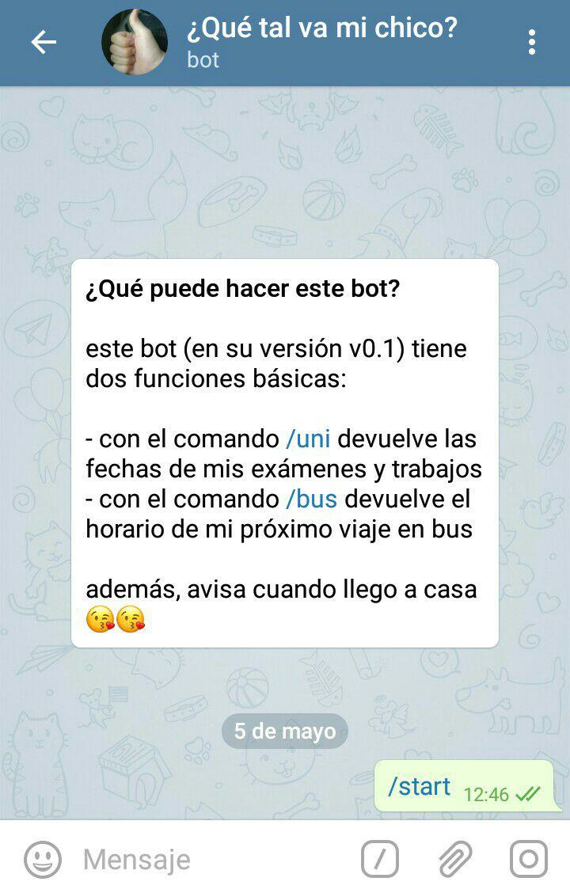

# mum-gift
telegram-bot as a mother's day gift

## what does this bot do?

this bot (v0.2) has two basic functionalities:

- with `/uni` command, it returns my exams and classwork's dates
- with `/bus` command, it returns my next bus travel's schedule

### configuration

replace all the values sorrounded by '==VALUE==', that is:
- your user_bot's token and your user's chat_id in `quetalvamichico_bot.py`
- your admin_bot's token and your admin's chat_id in `admin_qtvmc.py`

## TODOs

- [x] Fix timezone
- [x] Format from_to(dayStart,timeStart,timeEnd)
- [x] Add weekday
- [x] ping (message when i get home)

v0.2 ready!
